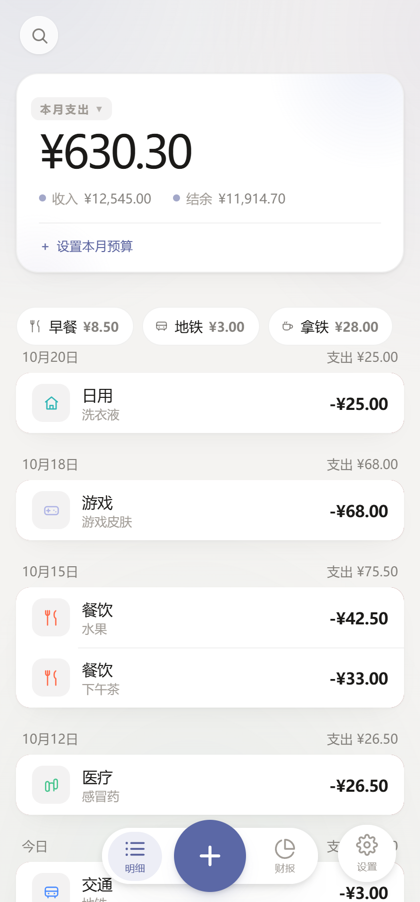
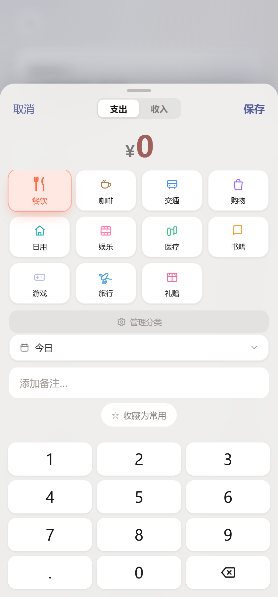
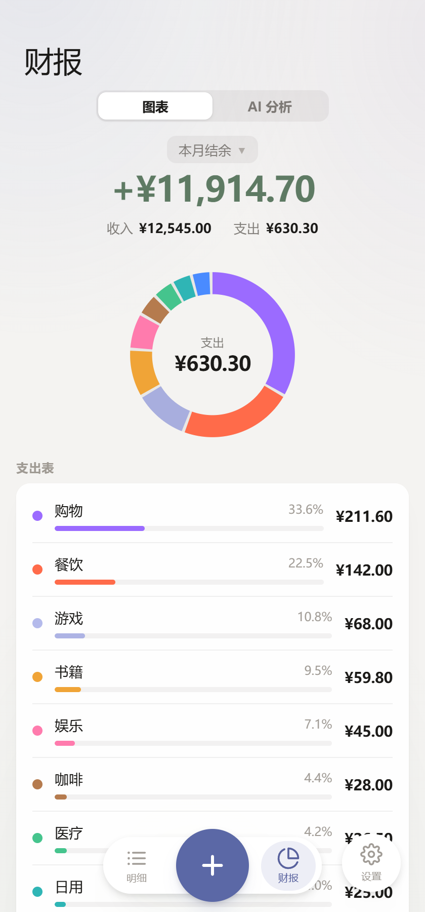

# Ledger · 个人记账本

> 3 秒记一笔、完全离线的个人记账本。Rust + SQLite 单机内核，你的账本只存在你自己的设备上。


---

## 界面预览

<div align="center" style="display:flex; flex-wrap:wrap; gap:16px; justify-content:center;">
  
  
  
</div>

---

Ledger 是一款**离线优先（offline-first）**的个人记账工具。它把「数据主权」当作首要约束：账目写入本机 `ledger.sqlite`，没有账号体系、没有云同步、默认不发任何网络请求，断网状态与联网状态功能完全等价。

界面以清晰、克制为原则，交互按单手操作的直觉来组织，实现上则刻意做减法——前端**零框架、零打包器**，`index.html` 通过一个 `type="module"` 标签直接加载 `main.js`，改完刷新即生效。不做引导流程、不做社交信息流、不做游戏化提醒，只有你的账目、你的数据和一张能看清钱去哪了的图表。

---

## 功能

**记账**

- 新增支出 / 收入，数字键盘输入，金额以「分」为单位存储，杜绝浮点误差
- 月流水按天分组，展示当日收支合计，顶部卡片汇总本月支出 / 收入 / 结余
- 任意历史月份切换（前 12 个月 ~ 后 3 个月）
- 修改金额、修改日期、删除记录、清空全部记录
- 快捷模板：把常用账目存成模板，一键记账

**统计**

- 年 / 月 / 周 / 天四种周期切换（周起点为周一）
- 圆环图展示分类支出占比，下方按金额降序排列分类明细
- 结余 = 收入 − 支出，正负分色显示

**分类与预算**

- 分类增删改、拖拽排序、使用频率统计
- 删除分类时记录可转移至兜底分类，不产生孤儿数据
- 月度预算设置

**AI 消费分析（可选）**

- 接入大模型对消费记录做归纳分析，详见 [AI 消费分析](#ai-消费分析兼容性与容错设计)

**其他**

- 浅色 / 深色主题切换，默认跟随系统
- 数据库备份与恢复（导出 / 导入）

---

## 技术栈

| 层 | 技术 | 版本 | 说明 |
|---|---|---|---|
| 跨端框架 | Tauri | 2.11 | 支持 Android 与 Windows 桌面端 |
| 后端 | Rust (edition 2021) | — | 7 个模块，注册 **31 个 `#[tauri::command]`** |
| 数据库 | SQLite via rusqlite（bundled） | 0.32 | 静态编入，无外部依赖 |
| 前端 | 原生 HTML / CSS / ES Module | — | 0 npm 依赖、0 构建步骤：`main.js` 3448 行、`styles.css` 2142 行、`index.html` 636 行；Excel 解析库以静态文件随包分发于 `src/vendor/` |
| HTTP | reqwest + rustls(ring)，纯 Rust TLS | 0.13 / 0.23 | `default-features = false`，刻意避开 OpenSSL |
| 日期 | chrono | 0.4 | |
| 凭据存储 | keyring（windows-native） | 3.x | 按平台条件编译 |
| 打包 | Tauri Bundler | — | Android：Gradle；Windows：NSIS |

TLS 特意选用 **rustls + ring**（纯 Rust 实现），因此 Android 与 Windows 编译都**不需要** cmake、nasm 或 OpenSSL（启动时显式 `install_default()` 安装 crypto provider）。

---

## 架构与数据模型

单连接 `Mutex<Connection>` 由 Tauri 托管为应用状态，前端通过 `invoke` 调用命令；涉及网络的 async 命令（`ai_analyze` / `ai_test_key`）先把数据库锁的作用域收敛，**不跨 `await` 持有锁**。

建表语句幂等（`CREATE TABLE IF NOT EXISTS`），共 5 张表：

| 表 | 用途 | 关键设计 |
|---|---|---|
| `transactions` | 流水 | `amount_cents INTEGER`；`type` 带 `CHECK IN ('expense','income')`；`date` 建索引 |
| `categories` | 分类 | `icon` / `color` / `sort` / `builtin`，支持拖拽排序 |
| `budgets` | 月度预算 | `month` 主键 |
| `templates` | 常用项 | 与流水同构，去掉日期 |
| `settings` | 键值配置 | 主题、AI 服务商配置等 |

**兼容性处理**：首次启动写入 13 条预置分类，其 `id` 沿用历史硬编码值，保证旧记录 100% 兼容；预置写入只在建表那一次执行，用户删掉后不会复活。

**金额全程不出现浮点**：后端以整数「分」落库，对外用 `"12.34"` 字符串传输，解析时逐位校验（单一小数点、整数位 ≤ 9、小数位 ≤ 2、必须 > 0）。

---

## 隐私与凭据模型

- **默认零网络**：不点「分析」就不会有任何出站请求
- **本地 / 内网地址自动识别**：`localhost`、`127.0.0.1`、`::1`、`*.local`、`host.docker.internal`、`10.x`、`192.168.x`、`172.16–31.x`、`169.254.x` 视为自建服务，免 Key 且放宽超时（120s，云端 45s）
- **API Key 三档存储**（系统钥匙串仅 Windows 可用，Android 上自动回落到后两档）：
  1. 系统凭据管理器（Windows 凭据管理器）
  2. 本机数据库
  3. **仅内存**（进程内 `Mutex<Option<String>>`，退出即失效）
- **Key 不回传前端**：界面只回显前 3 后 4 位掩码；旧版本的 `deepseek_api_key` 自动迁移
- **备份不带凭据**：导出走临时副本库并清除 `ai_api_key` / `deepseek_api_key` / `ai_key_hint`，任一环节失败自动回退原始字节，保证导出功能本身不受影响
- **导入是原子的**：临时文件 → `ATTACH DATABASE` → 校验 `sqlite_master` 中确有 `transactions` 表 → 事务内整体覆盖并提交 → `DETACH` 清理；缺 `budgets` / `templates` / `categories` 的旧备份自动跳过对应表；分类按「合并」导入（同 id 覆盖），不整表清空，避免备份缺分类时把兜底分类「其他」一并删掉

---

## AI 消费分析：兼容性与容错设计

接大模型最容易踩的坑是「各厂商支持的可选参数不一致」，这里用**能力档位降级**解决：

- **降级阶梯**：`json_mode + thinking` → `仅 json_mode` → `纯文本`，逐档重试
- **可重试判定**：只有 400 / 404 / 422 且响应体明确提示 `response_format`、`json_object`、`thinking`、`unsupported` 等关键字时，才判定为「参数不支持」并降级；401 / 402 / 429 / 5xx 映射为可读中文提示，不盲目重试
- **参数适配**：`thinking` 只发给 DeepSeek；推理类模型（`reasoner` / `r1` / `o1` / `o3` / `o4`）自动去掉 `temperature`
- **Base URL 归一化**：自动补 `/chat/completions`，已带路径则不重复拼接
- **输出解析容错**：剥离 Markdown 代码块围栏、取首 `{` 到末 `}`、字段别名兜底（`verdict` / `评价` / `status`）、数字兼容字符串，以适配小模型的不规范输出
- **可配置**：服务商 / Base URL / 模型名均可自行修改，兼容任意 OpenAI 风格接口；默认指向 DeepSeek

---

## 工程质量

- 后端 `src-tauri/src` 含 **18 个 Rust 单元测试**（`service.rs` 4 个、`ai.rs` 11 个、`keys.rs` 3 个，另有 1 个联网测试默认 `ignore`）
- 覆盖：围栏剥离、字段别名与非法输出兜底、Base URL 去重、本地地址识别、能力降级可重试性判定、id 唯一性（同毫秒连续写入不撞车）、分类删除的兜底校验
- 用 `TcpListener` 起 mock OpenAI 服务端做**端到端降级验证**，另有一条真实 TLS 连通性测试
- 圆环图手写 SVG（`stroke-dasharray` / `stroke-dashoffset` + 缓动过渡），不引入图表库

---

## 环境准备

1. **Rust** —— <https://rustup.rs>
2. **Node.js** 18+ —— 用于运行 Tauri CLI
3. **Tauri 系统依赖** —— 见官方文档 <https://tauri.app/start/prerequisites/>
   - Android：Android Studio、NDK、JDK 17，并配置 `ANDROID_HOME` / `NDK_HOME`
   - Windows：Microsoft C++ 生成工具 + WebView2

## 快速开始

```bash
npm install          # 安装 Tauri CLI 及前端依赖

npm run tauri dev    # 桌面端开发模式，热重载
```

### Android

```bash
npm run tauri android init     # 生成 gen/android 工程（首次，之后已入库无需再跑）
npm run tauri android dev      # 真机 / 模拟器调试
npm run tauri android build    # 产出 APK / AAB
```

> `src-tauri/gen/android/` 下的 Gradle 工程已纳入版本管理（Tauri 生成的 `.gitignore` 只排除 `build`、`.gradle` 等编译产物），因此克隆后可直接构建，无需重新 `init`。

### Windows 桌面端

```bash
npm run tauri build    # 产出 NSIS / MSI 安装包
```

### 目标平台与体积预算

| 项 | 目标 |
|---|---|
| 平台 | Android 7.0+（API 24+）/ Windows 10+ |
| 体积 | APK < 50 MB，Windows 安装包 < 10 MB |
| 性能 | 冷启动 < 2s，单笔记账 ≤ 3s |

---

## 项目结构

```
ledger/
├── src/                        前端（原生 HTML/CSS/JS）
│   ├── index.html
│   ├── styles.css
│   ├── main.js
│   └── vendor/                 随包分发的第三方库（SheetJS，离线解析 Excel）
├── src-tauri/                  Rust 后端
│   ├── src/
│   │   ├── main.rs             入口
│   │   ├── lib.rs              Tauri 命令注册（30 个 invoke 命令）
│   │   ├── models.rs           数据结构
│   │   ├── db.rs               SQLite 连接与建表
│   │   ├── service.rs          业务逻辑：金额 / 日期 / 分类校验、增删改查
│   │   ├── keys.rs             API Key 存储（系统凭据管理器 / 数据库 / 内存）
│   │   └── ai.rs               DeepSeek 等 OpenAI 风格接口客户端
│   ├── capabilities/           权限声明
│   ├── icons/                  应用图标
│   ├── gen/android/            Android 工程
│   ├── Cargo.toml
│   └── tauri.conf.json
├── package.json
└── .gitattributes
```

## 数据存放位置

数据库文件 `ledger.sqlite` 由系统分配的应用数据目录承载，**不在本仓库内**：

- Android：应用私有数据目录
- Windows：`%APPDATA%\<identifier>\ledger.sqlite`

因此克隆仓库不会带上任何真实账目数据；请使用应用内的「备份」功能迁移数据。

---

## 许可证

[MIT](LICENSE)
